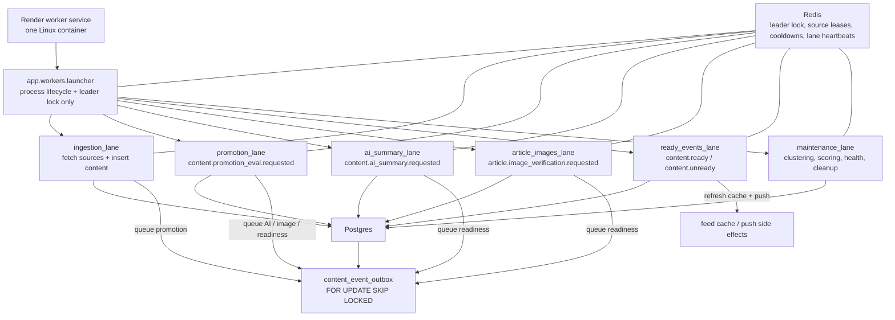

# Single-Service Worker Lanes

Blips runs one Render worker service. Inside that one Linux container, the
launcher starts small independent lane processes. Lanes coordinate through
durable Postgres/Redis state; they do not call each other inline.

## Rules

- Ingestion is only a producer: fetch sources, insert content, queue events.
- Promotion, AI summaries, image verification, and ready/unready handling run
  in their own lanes.
- No lane waits because another lane is active.
- Lanes may back off only for real resource pressure: memory, DB pressure,
  source cooldowns, or item/event-level locks.
- The launcher owns lifecycle only: start lanes, forward shutdown, and stop the
  container if a critical lane exits.
- If a lane process exits, the launcher exits the whole container so Render
  restarts it. If a lane stays alive but stops heartbeating, the launcher
  watchdog also exits the container after the configured stale window.
- The durable outbox is the source of truth. Redis pub/sub can be added later
  as a wake-up hint, but it must not replace durable work rows.

## Recovery

- Crash recovery is fail-fast: one lane crash causes a full worker restart.
- Hang recovery is heartbeat-based: each lane writes Redis heartbeats, and the
  launcher treats stale heartbeats as unhealthy.
- Defaults: `WORKER_LANE_STALE_SECONDS=900`,
  `WORKER_LANE_WATCHDOG_INTERVAL_SECONDS=30`,
  `WORKER_LANE_STARTUP_GRACE_SECONDS=120`.
